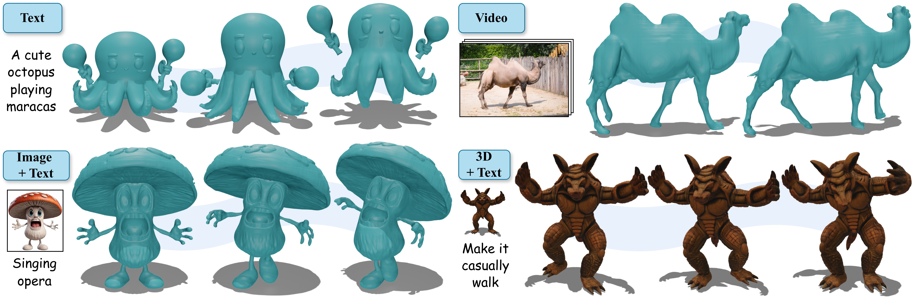
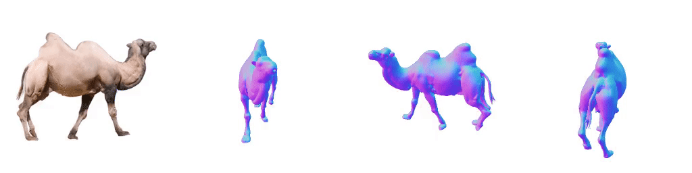
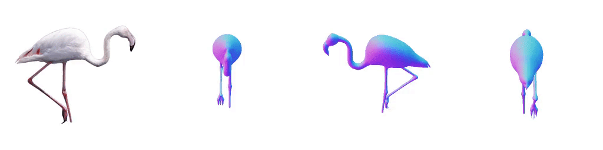
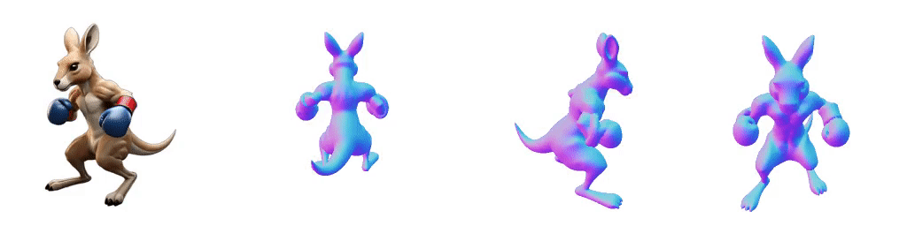
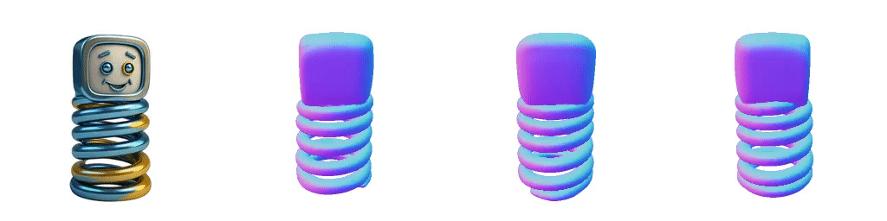
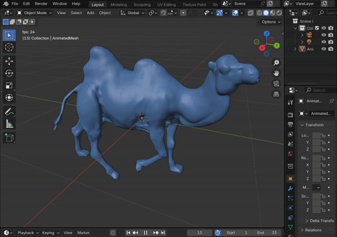

<div align="center">


<h1>🎬 ActionMesh: Animated 3D Mesh Generation with Temporal 3D Diffusion</h1>

<a href="https://remysabathier.github.io/actionmesh/"></a>

**[Meta Reality Labs](https://ai.facebook.com/research/)**;  **[SpAItial](https://www.spaitial.ai/)**; **[University College London](https://geometry.cs.ucl.ac.uk/index.php)**

[Remy Sabathier](https://www.linkedin.com/in/r%C3%A9my-sabathier-97b264179/), [David Novotny](https://d-novotny.github.io/), [Niloy J. Mitra](http://www0.cs.ucl.ac.uk/staff/n.mitra/), [Tom Monnier](https://tmonnier.com/)
</div>



## 📖 Overview

**ActionMesh** is a **fast Video** → **Animated 3D Mesh** model that generates an animated 3D mesh (topology fixed) from input videos (real or synthetic).


## 🆕 Updates

- **2025-01-21**: Code released!


## ⚙️ Installation

### Requirements

- **GPU**: NVIDIA GPU with at least 32GB VRAM (tested on A100, H100, and H200)
- **PyTorch**: Requires PyTorch and torchvision (developed with torch 2.4.0 / CUDA 12.1 and torchvision 0.19.0)

### 1. Clone and Install Dependencies

```bash
git clone git@github.com:facebookresearch/actionmesh.git
cd actionmesh
git submodule update --init --recursive
pip install -r requirements.txt
pip install -e .
```

### 2. Optional Dependencies

| Dependency | Purpose | Installation |
|------------|---------|--------------|
| **PyTorch3D** | Video rendering of animated meshes | [Installation guide](https://github.com/facebookresearch/pytorch3d/blob/main/INSTALL.md) |
| **Blender 3.5.1** | Export animated mesh as a single `.glb` file | [Download](https://download.blender.org/release/Blender3.5/) |


## 🚀 Quick Start

### Basic Usage

Generate an animated mesh from an input video:

```bash
python inference/video_to_animated_mesh.py --input assets/examples/davis_camel
```

### Fast Mode

For faster inference (as used in the [HuggingFace demo](https://huggingface.co/spaces/facebook/ActionMesh)), use the `--fast` flag:

```bash
python inference/video_to_animated_mesh.py \
    --input assets/examples/davis_camel \
    --fast
```

**Performance comparison on H100 GPU:**

| Mode | Time | Quality |
|------|------|---------|
| Default | ~115s | Higher quality |
| Fast (`--fast`) | ~45s | Slightly reduced quality |

### Exporting Animated Mesh

To export a single animated mesh file (importable in Blender), specify the path to your Blender executable:

```bash
python inference/video_to_animated_mesh.py \
    --input assets/examples/davis_camel \
    --blender_path "path/to/blender/executable"
```

### Model Downloads

On the first launch, ActionMesh weights and external models are automatically downloaded from HuggingFace:

| Model | Source | Local Path |
|-------|--------|------------|
| **ActionMesh** | [facebook/ActionMesh](https://huggingface.co/facebook/ActionMesh) | `pretrained_weights/ActionMesh` |
| **TripoSG** (image-to-3D) | [VAST-AI/TripoSG](https://huggingface.co/VAST-AI/TripoSG) | `pretrained_weights/TripoSG` |
| **DinoV2** | [facebook/dinov2-large](https://huggingface.co/facebook/dinov2-large) | `pretrained_weights/dinov2` |
| **RMBG** | [briaai/RMBG-1.4](https://huggingface.co/briaai/RMBG-1.4) | `pretrained_weights/RMBG` |


## 🎨 Examples

We provide example sequences in `assets/examples/` with expected outputs for testing and debugging your installation:

| Example | Type | Expected Output |
|---------|------|-----------------|
| `davis_camel` |  [](https://davischallenge.org/) |  |
| `davis_flamingo` |  [](https://davischallenge.org/) |  |
| `kangaroo` |  |  |
| `spring` |  |  |


## 🎬 Input

The `--input` argument accepts:
- A `.mp4` video file
- A folder containing PNG images

The number of input frames should be between **16** and **31** (default is 16). Any additional frames will be ignored.

### Masks

Input frames can be provided with or without alpha masks. If no mask is provided, [RMBG](https://huggingface.co/briaai/RMBG-1.4) background removal model is automatically applied to each frame before processing.

> **Tip:** For custom videos, we strongly recommend using the [SAM2 demo](https://sam2.metademolab.com/demo) to isolate the animated subject on a white background, as RMBG may have limited performance on complex scenes. See our [SAM2 extraction guide](assets/docs/sam2_extraction_guide.md) for detailed instructions.


## 📦 Export

The model exports a folder containing:

| Output | Description | Requirements |
|--------|-------------|--------------|
| **Per-frame meshes** | One `.glb` mesh file per timestep (`mesh_000.glb`, `mesh_001.glb`, ...) | None (default) |
| **Animated mesh** | Single `animated_mesh.glb` with embedded animation, importable in Blender | [Blender 3.5.1](https://download.blender.org/release/Blender3.5/) |
| **Video** | Rendered `.mp4` video of the animated mesh | [PyTorch3D](https://github.com/facebookresearch/pytorch3d/blob/main/INSTALL.md) |

<details>
<summary><b>🎥 Video output preview</b></summary>
<br>

</details>

<details open>
<summary><b>🎞️ Animated mesh file imported in Blender</b></summary>
<br>

</details>


## 🏛️ License

See the LICENSE file for details about the license under which this code is made available.


## 🙏 Acknowledgements

ActionMesh builds upon the following open-source projects. We thank the authors for making their work available:

| Project | Description |
|---------|-------------|
| [TripoSG](https://github.com/VAST-AI-Research/TripoSG) | Image-to-3D mesh generation |
| [DINOv2](https://github.com/facebookresearch/dinov2) | Self-supervised vision features |
| [Diffusers](https://github.com/huggingface/diffusers) | Diffusion model framework |
| [Transformers](https://github.com/huggingface/transformers) | Transformer model library |
| [RMBG-1.4](https://huggingface.co/briaai/RMBG-1.4) | Background removal model |
