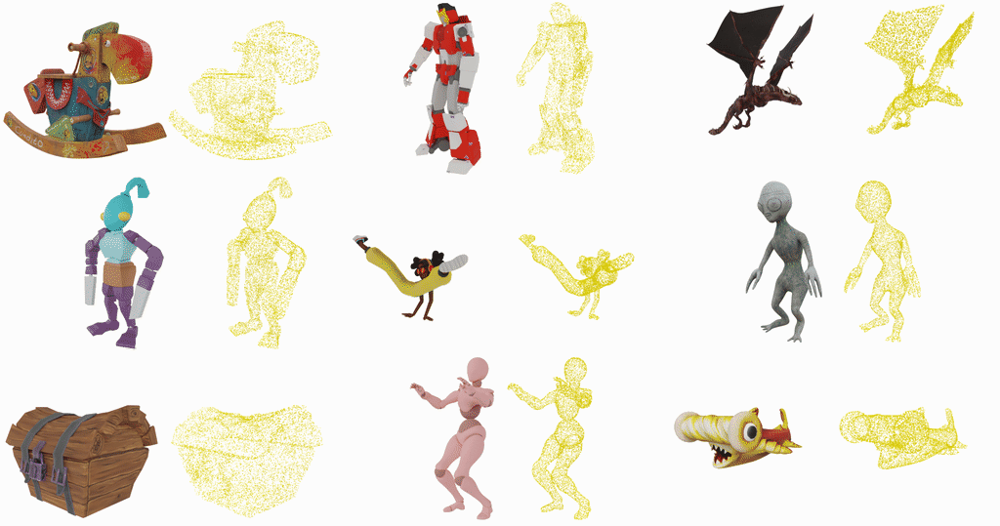

<div align="center">

<h1>🎬 ActionBench: Paired Video-3D Synthetic Benchmark</h1>

<a href='https://huggingface.co/datasets/facebook/actionbench'></a>




</div>

## 📖 Overview

ActionBench is a benchmark dataset of **128 paired video ↔ animated point-cloud samples** for evaluating animated 3D mesh generation from video.

Each sample contains:
- **Video**: 16 RGBA frames with alpha mask
- **Animated Point Cloud**: Surface points sampled on the animated object with shape `(T, V, 6)` where:
  - `T=16`: number of keyframes
  - `V`: number of vertices (points randomly sampled on the mesh surface)
  - `6`: position `(x, y, z)` + normal `(nx, ny, nz)` for each point

  > **Note:** The point cloud is **tracked**: each point index corresponds to the same surface point deformed across timesteps, providing dense correspondences over time.

The dataset consists of synthetic scenes of animated objects from [ObjaverseXL](https://objaverse.allenai.org/), rendered using **Blender 3.5.1**.

## 📊 Evaluation

To evaluate on ActionBench, produce a list of animated meshes saved as `.glb` files.

Each subdirectory must be named with the corresponding `uid` from ActionBench:

```
predictions/
├── <uid_1>/
│   ├── mesh_00.glb
│   ├── mesh_01.glb
│   └── ...
├── <uid_2>/
│   ├── mesh_00.glb
│   └── ...
└── ...
```

Download the [ActionBench](https://huggingface.co/datasets/facebook/actionbench) dataset, then run the evaluation script:

```bash
python actionbench/evaluate.py \
    --pred_root predictions/ \
    --gt_root data/actionbench/data/ \
    --output_csv results.csv \
    --device cuda
```

> **Note:** Evaluation requires the same dependencies as [ActionMesh](../README.md) plus [PyTorch3D](https://github.com/facebookresearch/pytorch3d/blob/main/INSTALL.md).

Metrics are described in the [ActionMesh paper](https://arxiv.org/abs/2601.16148):
- **CD-3D**: Chamfer Distance 3D — measures geometric accuracy per frame
- **CD-4D**: Chamfer Distance 4D — measures spatio-temporal consistency
- **CD-M**: Motion Chamfer Distance — measures motion fidelity

## 🏛️ License

See the LICENSE file for details about the license under which this dataset is made available.

## 📚 Citation

If you use ActionBench, please cite the following paper:

```bibtex
@inproceedings{ActionMesh2025,
  author = {Remy Sabathier and David Novotny and Niloy Mitra and Tom Monnier},
  title = {ActionMesh: Animated 3D Mesh Generation with Temporal 3D Diffusion},
  year = {2025},
}
```
